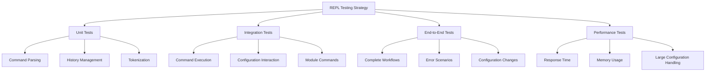

```mermaid
flowchart TD
    A[REPL Testing Strategy] --> B[Unit Tests]
    A --> C[Integration Tests]
    A --> D[End-to-End Tests]
    A --> E[Performance Tests]
    
    B --> B1[Command Parsing]
    B --> B2[History Management]
    B --> B3[Tokenization]
    
    C --> C1[Command Execution]
    C --> C2[Configuration Interaction]
    C --> C3[Module Commands]
    
    D --> D1[Complete Workflows]
    D --> D2[Error Scenarios]
    D --> D3[Configuration Changes]
    
    E --> E1[Response Time]
    E --> E2[Memory Usage]
    E --> E3[Large Configuration Handling]
```