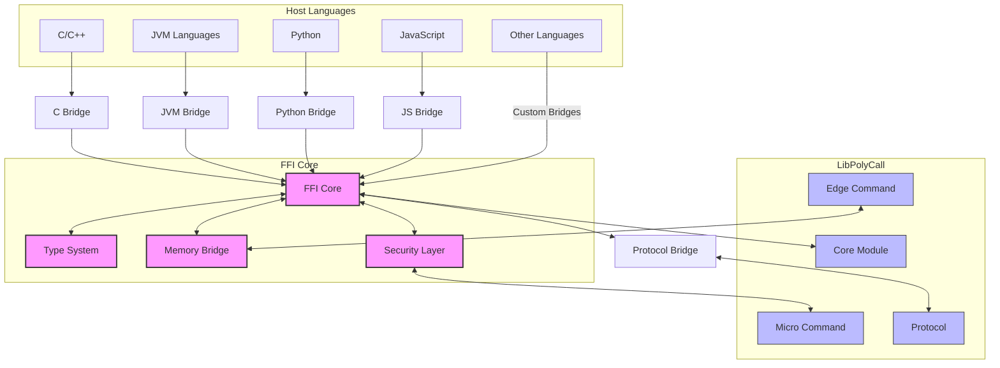

```mermaid
flowchart TD
    subgraph "Host Languages"
        JS[JavaScript]
        PY[Python]
        JVM[JVM Languages]
        C[C/C++]
        Other[Other Languages]
    end

    subgraph "FFI Core"
        FFICore[FFI Core]
        TypeSystem[Type System]
        MemBridge[Memory Bridge]
        Security[Security Layer]
    end

    subgraph "LibPolyCall"
        PolyCore[Core Module]
        PolyMicro[Micro Command]
        PolyEdge[Edge Command]
        PolyProto[Protocol]
    end

    %% Language to FFI connections
    JS --> JSBridge[JS Bridge]
    PY --> PyBridge[Python Bridge] 
    JVM --> JVMBridge[JVM Bridge]
    C --> CBridge[C Bridge]
    Other --> |Custom Bridges| FFICore

    %% Bridge to Core connections
    JSBridge --> FFICore
    PyBridge --> FFICore
    JVMBridge --> FFICore
    CBridge --> FFICore

    %% Core internal connections
    FFICore <--> TypeSystem
    FFICore <--> MemBridge
    FFICore <--> Security

    %% Core to LibPolyCall connections
    FFICore <--> ProtoBridge[Protocol Bridge]
    ProtoBridge <--> PolyProto
    
    FFICore <--> PolyCore

    Security <--> PolyMicro
    PolyEdge <--> MemBridge

    class FFICore,TypeSystem,MemBridge,Security emphasis
    classDef emphasis fill:#f9f,stroke:#333,stroke-width:2px

    class PolyCore,PolyMicro,PolyEdge,PolyProto polycore
    classDef polycore fill:#bbf,stroke:#333,stroke-width:1px
```