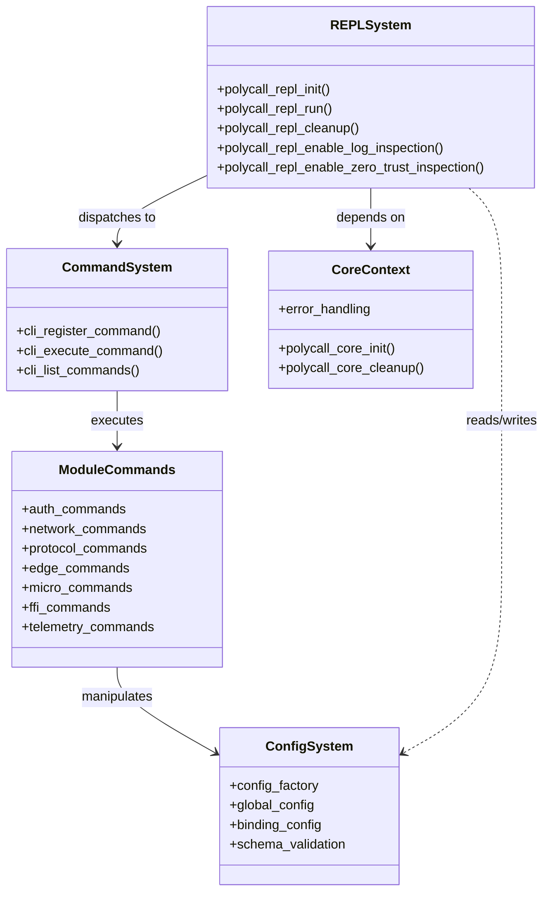

```mermaid
classDiagram
    class REPLSystem {
        +polycall_repl_init()
        +polycall_repl_run()
        +polycall_repl_cleanup()
        +polycall_repl_enable_log_inspection()
        +polycall_repl_enable_zero_trust_inspection()
    }
    
    class CommandSystem {
        +cli_register_command()
        +cli_execute_command()
        +cli_list_commands()
    }
    
    class ConfigSystem {
        +config_factory
        +global_config
        +binding_config
        +schema_validation
    }
    
    class CoreContext {
        +polycall_core_init()
        +polycall_core_cleanup()
        +error_handling
    }
    
    class ModuleCommands {
        +auth_commands
        +network_commands
        +protocol_commands
        +edge_commands
        +micro_commands
        +ffi_commands
        +telemetry_commands
    }
    
    REPLSystem --> CoreContext : depends on
    REPLSystem --> CommandSystem : dispatches to
    CommandSystem --> ModuleCommands : executes
    ModuleCommands --> ConfigSystem : manipulates
    REPLSystem ..> ConfigSystem : reads/writes

```